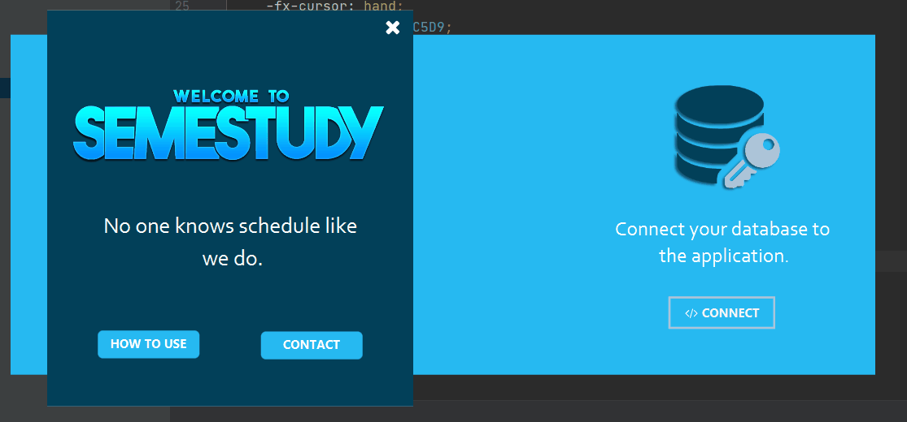

[![Contributors][contributors-shield]][contributors-url]
[![Forks][forks-shield]][forks-url]
[![Stargazers][stars-shield]][stars-url]
[![Issues][issues-shield]][issues-url]
[![MIT License][license-shield]][license-url]
[![Watch][watch-shield]][watch-url]
[![LinkedIn][linkedin-shield]][linkedin-url]

<!-- PROJECT LOGO -->
 

  

  <h3 align="center">SEMESTUDY</h3>

  

    This project is meant to manually/automatically generate the schedule of an entire university per semester
     
    <a href="https://github.com/mrabobi/semestudy"><strong>Explore the docs »</strong></a>
     
     
    <a href="https://github.com/mrabobi/semestudy">View Demo</a>
    ·
    <a href="https://github.com/mrabobi/semestudy/issues">Report Bug</a>
    ·
    <a href="https://github.com/mrabobi/semestudy/issues">Request Feature</a>
  

<!-- TABLE OF CONTENTS -->
## Table of Contents

* [About the Project](#about-the-project)
  * [Built With](#built-with)
* [Usage](#usage)
* [Roadmap](#roadmap)
* [Coordinating Teacher](#coordinating-teacher)
* [License](#license)
* [Contact](#contact)

<!-- ABOUT THE PROJECT -->
## About The Project

The project's meaning is to create a schedule for each education stage, be it university, highschool or primary. It is a flexible program wich allows the user to modify and view the result in real-time. Once the user is done and content with the outcome he can save the it in multiple ways(XML/PDF/JSON).

### Built With

* [JavaFX](https://openjfx.io/)
* [SceneBuilder](https://gluonhq.com/products/scene-builder/)
* [Adobe Photoshop](https://www.photoshop.com/en)

<!-- ROADMAP -->
## Roadmap

See the [open issues](https://github.com/mrabobi/semestudy/issues) for a list of proposed features (and known issues).

<!-- Coordinating Teacher -->
## Coordinating Teacher

* [Lect. Dr. Cristian Frasinaru](https://profs.info.uaic.ro/~acf)
* [Colab. Cusmuliuc Ciprian-Gabriel](https://www.linkedin.com/in/cipriancusmuliuc)

<!-- LICENSE -->
## License

Distributed under the MIT License. See `LICENSE` for more information.

<!-- CONTACT -->
## Contact

Miron Robert-Andrei - [@LinkekInContact](https://www.linkedin.com/in/mrobertandrei) - robertandrei.miron@gmail.com

Project Link: [https://github.com/mrabobi/semestudy](https://github.com/mrabobi/semestudy)

<!-- MARKDOWN LINKS & IMAGES -->
<!-- https://www.markdownguide.org/basic-syntax/#reference-style-links -->
[contributors-shield]: https://img.shields.io/github/contributors/mrabobi/semestudy.svg?style=flat-square
[contributors-url]: https://github.com/mrabobi/semestudy/graphs/contributors
[forks-shield]: https://img.shields.io/github/last-commit/mrabobi/semestudy?style=flat-square
[forks-url]: https://github.com/mrabobi/semestudy/commits/master
[stars-shield]: https://img.shields.io/github/stars/mrabobi/semestudy.svg?style=flat-square
[stars-url]: https://github.com/mrabobi/semestudy/stargazers
[issues-shield]: https://img.shields.io/github/issues/mrabobi/semestudy.svg?style=flat-square
[issues-url]: https://github.com/mrabobi/semestudy/issues
[license-shield]: https://img.shields.io/github/license/mrabobi/semestudy.svg?style=flat-square
[license-url]: https://github.com/mrabobi/semestudy/blob/master/LICENSE
[linkedin-shield]: https://img.shields.io/badge/-LinkedIn-black.svg?style=flat-square&logo=linkedin&colorB=555
[linkedin-url]: https://www.linkedin.com/in/mrobertandrei/
[watch-shield]: https://img.shields.io/github/watchers/mrabobi/semestudy?style=social
[watch-url]: https://github.com/mrabobi/semestudy
[product-screenshot]: images/screenshot.png
